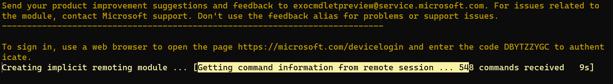

# ExO 2.0.6-preview 3 Tests

Works on Windows (see [interactive notebook](ExO206tests.ipynb)), works in WSL.

Docker has an interesting "quirk" - it creates a remoting module on Connect-ExchangeOnline (doesn't happen in Windows or WSL for that matter)

### Interactive in Container

`docker pull mcr.microsoft.com/powershell:7.2.1-ubuntu-20.04`

`docker run -it mcr.microsoft.com/powershell:7.2.1-ubuntu-20.04 /bin/bash`

In container:

```
apt-get update
apt-get -y install sudo

sudo pwsh

Install-Module -Name PSWSMan
Install-WSMan

exit

pwsh
Install-Module -Name ExchangeOnlineManagement

Connect-ExchangeOnline -Device

Get-EXOMailbox

Disconnect-ExchangeOnline -Confirm:$false
```

On Connect-ExchangeOnline, remoting module is created:

