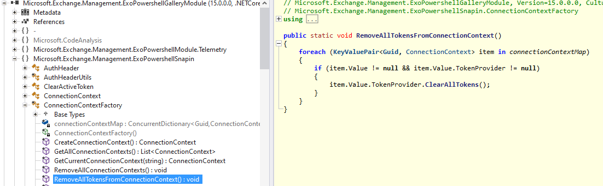

# Sample loading extracted ExchangeOnline module

https://www.powershellgallery.com/packages/ExchangeOnlineManagement/3.0.0

Manual Download / Download the raw nupkg file

* Save with extension .zip
* Make sure to go to Properties / check the Unblock and click Apply (otherwise won't execute)
* Extract to folder (you could delete _rels, package, xml + nuspec in root)
* Set appsettings.json / ExOConnectSettings / ModulePath, eg `"c:\\yourextracfolder\\ExchangeOnlineManagement.psd1"`

appSettings.Development.json sample

```json
{
  "DetailedErrors": true,
  "Logging": {
    "LogLevel": {
      "Default": "Information",
      "Microsoft.AspNetCore": "Warning"
    }
  },
  "ExOConnectSettings": {
    "PfxPath": "D:\\GitWorkspace\\sample.pfx",
    "PfxPassword": "",
    "AppId": "guidforpfxhere",
    "Organization": "youronmsdomainhere.onmicrosoft.com",
    "ModulePath": "D:\\GitWorkspace\\_exo3module_unpacked\\ExchangeOnlineManagement.psd1"
  }
}
```

# Connect-ExchangeOnline Observations

* NOTE that `New-EXOModule` in `ExchangeOnlineManagement.psm1` loads dynamic psd1 and psm1 from the Internet
* DO put a breakpoint an EXO call and dive into the newly downloaded %temp%/tmpEXO_* folder created by `New-EXOModule`
* DO open `ExchangeOnlineManagement.psm1`, search for `Get-HelpFiles` and comment that line. That loads less stuff.
* DO USE `SkipLoadingFormatData` on Connect-ExchangeOnline. That loads less stuff.

# Load Testing Observations

There would be often the error `You must call Connect-ExchangeOnline before calling any other cmdlet.` when running bombardier. Turns
out this is related to calling `Disconnect-ExchangeOnline` - it internally (implemented in ExchangeOnlineManagement.psm1) has a call to

```powershell
# Remove all ConnectionContexts
# this internally clears all the active tokens in ConnectionContexts
[Microsoft.Exchange.Management.ExoPowershellSnapin.ConnectionContextFactory]::RemoveAllConnectionContexts()
```

This method is using a static list to manage connections, and guess what, that leads to all existing connection tokens to be killed while those are still in use in other PowerShell instances (same process after all, thank you static).



So - either do not call `Disconnect-ExchangeOnline` or comment that line in the psm1.
