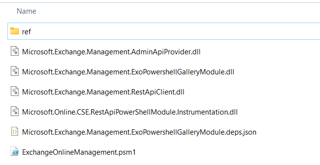

# Sample loading extracted ExchangeOnline module

https://www.powershellgallery.com/packages/ExchangeOnlineManagement/3.0.0

Manual Download / Download the raw nupkg file

* Save with extension .zip
* Make sure to go to Properties / check the Unblock and click Apply (otherwise won't execute)
* Extract to folder (you could delete _rels, package, xml + nuspec in root) - see later section "Minimum set of files to retain"
* Set appsettings.json / ExOConnectSettings / ModulePath, eg `"c:\\yourextracfolder\\ExchangeOnlineManagement.psd1"`

appSettings.Development.json sample

```json
{
  "DetailedErrors": true,
  "Logging": {
    "LogLevel": {
      "Default": "Information",
      "Microsoft.AspNetCore": "Warning"
    }
  },
  "ExOConnectSettings": {
    "PfxPath": "D:\\GitWorkspace\\sample.pfx",
    "PfxPassword": "",
    "AppId": "guidforpfxhere",
    "Organization": "youronmsdomainhere.onmicrosoft.com",
    "ModulePath": "D:\\GitWorkspace\\_exo3module_unpacked\\ExchangeOnlineManagement.psd1"
  }
}
```

# Connect-ExchangeOnline Observations

* NOTE that `New-EXOModule` in `ExchangeOnlineManagement.psm1` loads dynamic psd1 and psm1 from the Internet
* DO put a breakpoint on an EXO call, then dive into the newly downloaded `%temp%/tmpEXO_*` folder created by `New-EXOModule`
* DO open `ExchangeOnlineManagement.psm1`, search for `Get-HelpFiles` and comment that line. That loads less stuff.
* DO USE `SkipLoadingFormatData` on Connect-ExchangeOnline. That loads less stuff.

# Minimum set of files to retain 

The contents of the extracted netCore folder can be stripped down to the following files:



For that to work, you have to reference these respective NuGet packages:


```xml
	<ItemGroup>
		<PackageReference Include="Microsoft.IdentityModel.Logging" Version="7.3.1" />
		<PackageReference Include="Microsoft.IdentityModel.Tokens" Version="7.3.1" />
		<PackageReference Include="Microsoft.IdentityModel.Abstractions" Version="7.3.1" />
    <PackageReference Include="System.IdentityModel.Tokens.Jwt" Version="7.3.1" />
    <PackageReference Include="Microsoft.Bcl.AsyncInterfaces" Version="8.0.0" />
		<PackageReference Include="Microsoft.Identity.Client" Version="4.61.3" />
		<PackageReference Include="Microsoft.OData.Client" Version="7.21.3" />
	</ItemGroup>
```

You can check out **fromhosting_started_connect.txt** to see that the assemblies were actually loaded from the project and not the modules folder.